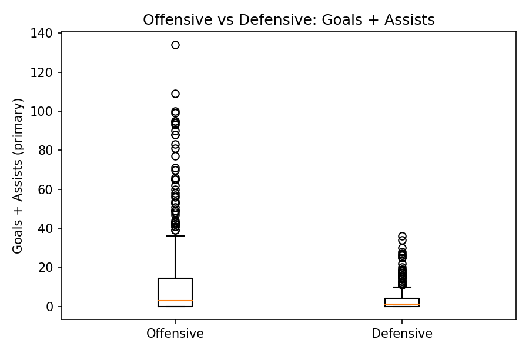
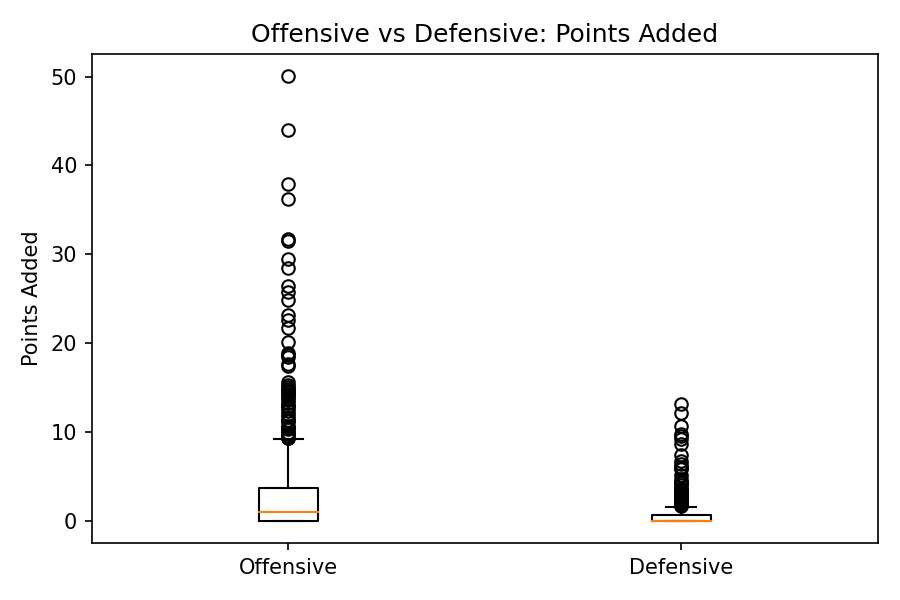
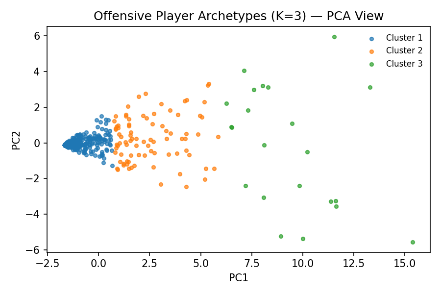
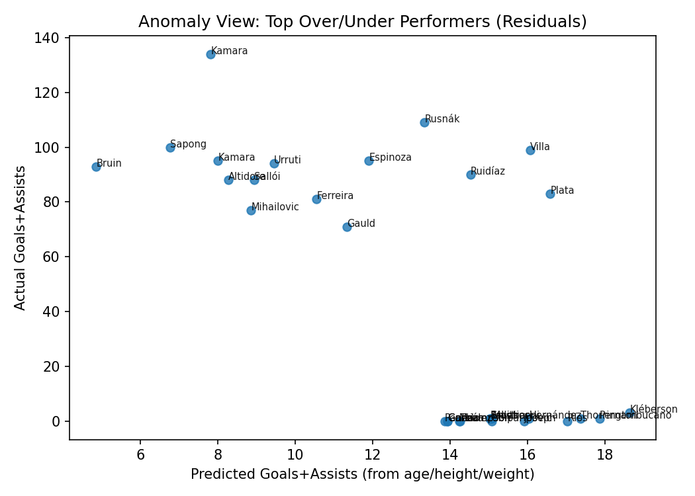

# MLS Player Archetypes & Anomaly Detection (Portfolio Repo)

This repo showcases a soccer analytics project using MLS player data to:
- compare offensive vs defensive production,
- discover offensive player archetypes with clustering, and
- flag outlier players who over/underperform relative to simple physical-trait baselines.

## What to look at first
- **Project analysis (RMarkdown):** `analysis/MLSPlayers_Analysis.Rmd`
- **Cleaned dataset:** `data/MLS_combined_data_cleaned.csv`
- **Key visuals:** `outputs/figures/`

## Key outputs (visuals)

## Methods (high level)
- **Position group comparison:** boxplots (and statistical tests in the RMarkdown).
- **Archetype discovery:** K-Means clustering on offensive players using key attacking features.
- **Anomaly detection:** linear regression baseline using age/height/weight; residuals highlight outliers.

## Reproduce
1. Open the RMarkdown: `analysis/MLSPlayers_Analysis.Rmd`
2. Ensure required R packages are installed (see package calls in the Rmd)
3. Knit / run sections to regenerate outputs.

## Notes
- The included dataset is the cleaned working dataset used for analysis.
